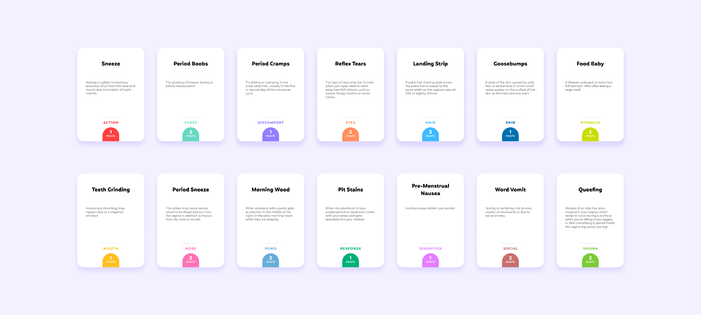

# Bod.ily

A card game about weird things our body does.

Designed by Diva Agarwal, John Chae, Salonee Gupta, Animesh Singh, Vera Wei, Yufeng Zhao. Advised by Geoff Kaufman and Erica Cruz.

## About the Game

[-> Medium Blog](https://saloneegupta.medium.com/bod-ily-9777563b196)

## Prepare Your Deck

You can print out [the full deck](./bod.ily-print-letter.pdf) on letter size paper and cut out the cards according to the crop marks.

## How to Play

### First Round

The clue-giver can verbally describe the term on the card in any way they want, as long as they don’t mention the actual term. We already provide descriptions on our cards, so clue-givers can choose to read from that verbatim if they don’t understand a certain term.

### Second Round

The same cards are re-shuffled and the clue-giver can only say one word for their teammates to guess.

### Final Round

The clues will be given by acting or drawing, which integrates our previous ideas and testing around Pictionary and Charades.

## External Links

[-> Word Sheet](https://docs.google.com/spreadsheets/d/1R6cs4lfCzRmwc11S2CPsOnlaRJmC33d_69Y6O_rG3v4/edit?usp=sharing)
